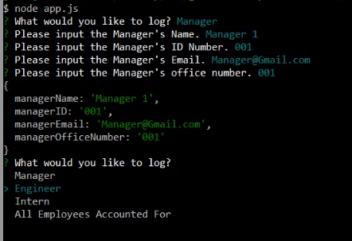
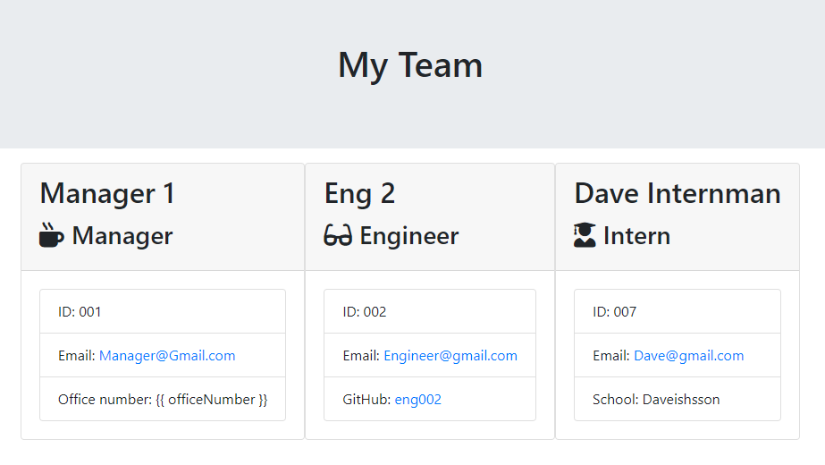

# Employee Summary Page Generator

The following application is a Command-Line-Interface product that generates a visually attractive HTML page after collecting information from the user. This app is to demonstrate modularization of methods, as well as to display our handle on npm packages.  



## License
  
MIT License 

## Table of Contents

* [Installation](#Installation)  
* [Usage](#Usage)  
* [License](#License)  
* [Contributing](#Contributing)  
* [Tests](#Contributing)  
* [Questions and Contact](#Questions and Contact)  

## Installation
```bash
npm i
```
## Usage
```bash
node app.js 
```
## Contributing

Open to collaboration and criticism. Please email for PR. 

## Tests

Testing done using Jest to confirm that UI is linked to the correct scripts. 

## Questions and Contact
For any questions and suggestions, please feel free to contact me at the following platforms:
* GitHub: WRXjasonSTI 
* Email: jasoncruz_rocks@gmail.com 

##
MIT License 
Copyright WRXjasonSTI
    